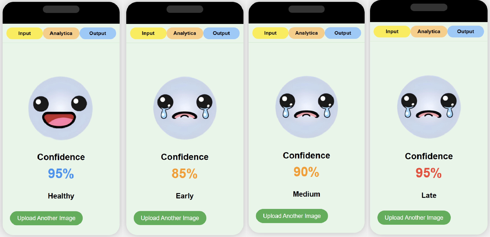

# Parkinson's Disease Image Classification System

This project implements a Parkinson's disease image classification system using multiple machine learning models, including KNN, SVM, Decision Tree, Naive Bayes, Linear Discriminant Analysis, and CNN.

## Web Interface Preview

The system features a mobile-friendly web interface with emoji-based result display:



The interface shows four classification results:
- **Healthy** (95% confidence) - Happy emoji
- **Early Stage** (85% confidence) - Sad emoji
- **Medium Stage** (90% confidence) - Sad emoji
- **Late Stage** (95% confidence) - Sad emoji

## Features

- **Multi-class Classification**: Classifies images into 4 categories:
  - 0: Healthy (健康)
  - 1: Early Stage Parkinson's (早期帕金森)
  - 2: Medium Stage Parkinson's (中期帕金森)
  - 3: Late Stage Parkinson's (晚期帕金森)

- **Mobile-Friendly Interface**: Responsive design optimized for mobile devices
- **Emoji-Based Results**: Visual feedback using emoji images
- **Confidence Display**: Shows prediction confidence percentage
- **Multiple ML Models**: Ensemble of KNN, SVM, Decision Tree, Naive Bayes, LDA, and CNN
- **CNN Priority**: CNN model has higher weight (9.0) for more accurate predictions
- **Image Preprocessing**: Padding-based resizing to maintain aspect ratio

## Project Structure

```
├── code_PD/               # MATLAB code for data preprocessing and model training
│   ├── Accuracy_Datapreprocess.xlsx
│   ├── Data_preprocess.m
│   ├── Loss_Datapreprocess.xlsx
│   ├── customreader.m
│   ├── f1_score.m
│   ├── plot_all_figure.m
│   ├── trainClassifier_KNN.m
│   ├── trainClassifier_LD.m
│   ├── trainClassifier_NB.m
│   ├── trainClassifier_SVM.m
│   ├── trainClassifier_Tree.m
│   └── writedata.m
├── checkpoints/           # Pre-trained model weights
│   ├── knn_model.pkl
│   ├── svm_model.pkl
│   ├── tree_model.pkl
│   ├── nb_model.pkl
│   ├── ld_model.pkl
│   ├── cnn_model.pth
│   └── scaler.pkl
├── templates/             # Flask web template
│   └── index.html         # Main web page with mobile UI
├── app.py                 # Flask application
├── train_model.py         # Python model training script
├── split_dataset.py       # Dataset splitting script
├── requirements.txt       # Python dependencies
├── webpage_picture.jpg    # Web interface preview image
└── .gitignore             # Git ignore file
```

## Installation

1. Clone the repository:
   ```bash
   git clone https://github.com/GodYYDS0417/Parkinson-classifier.git
   cd Parkinson-classifier
   ```

2. Install dependencies:
   ```bash
   pip install -r requirements.txt
   ```

## Usage

### 1. Dataset Preparation

The system uses a dataset with the following structure:
```
split_PD_datasets/
├── 0/                     # Healthy samples (90 images)
├── 1/                     # Early stage Parkinson's (90 images)
├── 2/                     # Medium stage Parkinson's (90 images)
└── 3/                     # Late stage Parkinson's (90 images)
```

Each image is preprocessed by:
- Splitting original images (left side: healthy, right side: Parkinson's)
- Data augmentation (horizontal flip) to balance classes
- Padding-based resizing to maintain aspect ratio

### 2. Train the models

Run the training script to train all models:

```bash
python train_model.py
```

This will generate the following model files in the `checkpoints/` directory:
- `knn_model.pkl`
- `svm_model.pkl`
- `tree_model.pkl`
- `nb_model.pkl`
- `ld_model.pkl`
- `cnn_model.pth`
- `scaler.pkl` (for data normalization)

### 3. Run the web application

Start the Flask web server:

```bash
python app.py
```

Open your browser and navigate to `http://127.0.0.1:5000` to use the web interface.

## Model Weights

You can download the pre-trained model weights from the following link:

- **Link**: [https://pan.baidu.com/s/1_lYi_c3V4hv9m-wUQalADw?pwd=5us6](https://pan.baidu.com/s/1_lYi_c3V4hv9m-wUQalADw?pwd=5us6)
- **Password**: 5us6

Download the checkpoints and place them in the `checkpoints/` directory.

## Technical Details

### Model Ensemble Weights
- KNN: 0.1
- SVM: 0.1
- Decision Tree: 0.1
- Naive Bayes: 0.5
- LDA: 0.2
- **CNN: 9.0** (Highest weight for best accuracy)

### CNN Architecture
- Input: 100x100x3 RGB images
- Conv2D: 32 filters, 3x3 kernel, padding=1
- Batch Normalization
- ReLU activation
- Fully Connected: 32*100*100 → 4 classes

### Image Preprocessing
- Padding to maintain aspect ratio (no stretching)
- Resize to 100x100 pixels
- Normalization (divide by 255)
- Channel-wise min extraction for traditional models
- 3-channel RGB for CNN

## License

This project is for research purposes only.
